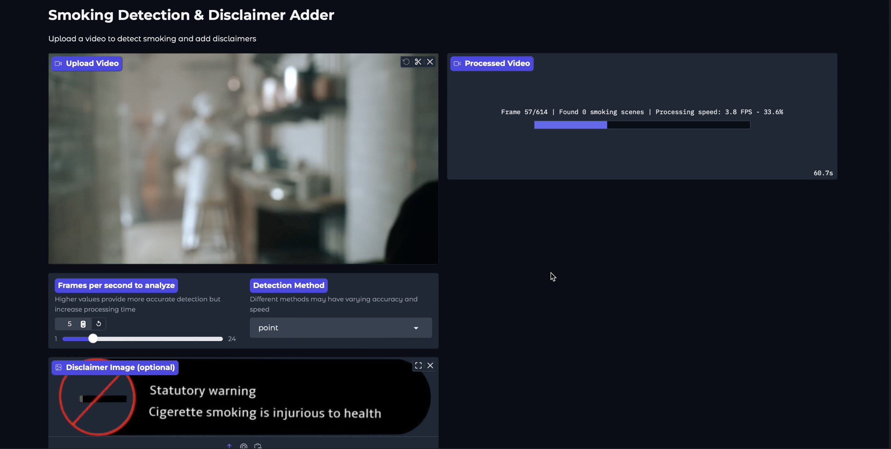
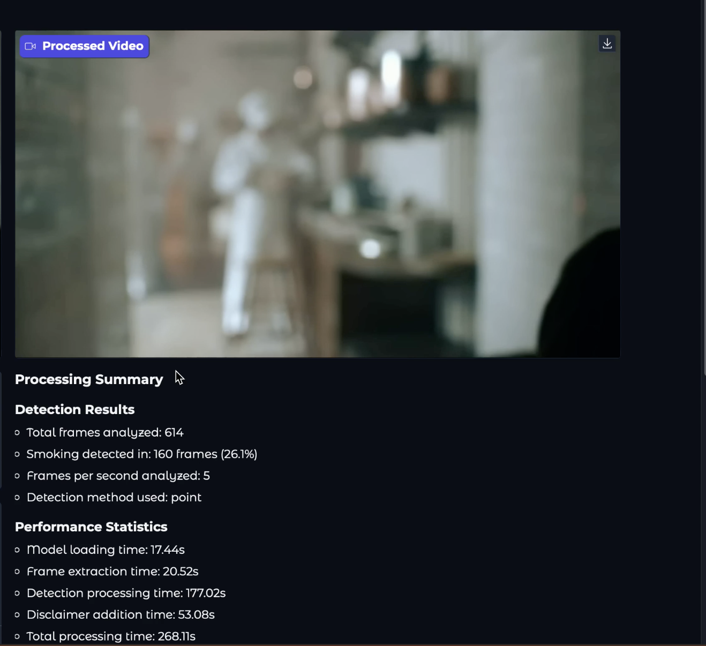

# Auto Disclaimer 🚭 🍺

[](https://opensource.org/licenses/MIT)
[](https://www.python.org/downloads/)
[](https://www.docker.com/)
[](https://gradio.app/)
[](https://huggingface.co/vikhyatk/moondream2)

## 📋 Table of Contents
- [Overview](#overview)
- [Problem Statement](#problem-statement)
- [Solution](#solution)
- [Demo](#demo)
- [UI Screenshots](#ui-screenshots)
- [Tech Stack](#tech-stack)
- [Current Challenges](#current-challenges)
- [Future Improvements](#future-improvements)
- [Installation and Usage](#installation-and-usage)
  - [Docker Deployment](#option-1-docker-deployment-recommended)
  - [Manual Installation](#option-2-manual-installation)
- [Usage Instructions](#usage-instructions)
- [Performance Tips](#performance-tips)
- [Contact](#contact)
- [License](#license)
- [Acknowledgements](#acknowledgements)

## 📝 Overview


Auto Disclaimer is an automated tool that adds smoking disclaimers to videos by detecting smoking scenes. The tool uses computer vision and machine learning to identify frames containing smoking activities and overlays appropriate disclaimers, eliminating the need for manual frame-by-frame editing.

## ❓ Problem Statement
Video editors currently spend significant time manually adding disclaimers to movies on a frame-by-frame basis whenever smoking scenes appear. This process is:
- ⏱️ Time-consuming
- ❌ Prone to human error
- 💰 Costly for production companies

## 💡 Solution
Our solution automates the disclaimer addition process by:
1. Processing video files frame by frame
2. Using the Moondream2 vision language model to detect smoking activities
3. Automatically overlaying appropriate disclaimers on relevant frames
4. Generating a new video with disclaimers integrated

## 🎬 Demo
Check out a sample processed video: [Example Output](output/1.mp4)

## 🖼️ UI Screenshots
<table>
  <tr>
    <td align="center"><b>Main Interface</b></td>
    <td align="center"><b>Processing Results</b></td>
  </tr>
  <tr>
    <td></td>
    <td></td>
  </tr>
</table>


## 🛠️ Tech Stack
| Technology | Purpose |
|------------|---------|
| **Python** | Core programming language |
| **[Moondream2](https://huggingface.co/vikhyatk/moondream2)** | Vision language model for smoking detection |
| **OpenCV** | Video processing and frame manipulation |
| **Gradio** | User-friendly web interface |
| **Docker** | Containerization for easy deployment |


## ⚠️ Current Challenges
| Challenge | Description |
|-----------|-------------|
| **Processing Speed** | Takes ~4 minutes to process a 4-minute video at 5 FPS |
| **Model Limitations** | Moondream2 (2B parameters) not optimized for smoking detection |
| **Resource Intensive** | High computational requirements for full-length movies |

## 🚀 Future Improvements
- 🧠 Develop a custom CNN model specifically trained on smoking detection data
- 🍺 Expand detection capabilities to include drinking scenes
- ⚡ Optimize processing pipeline for better performance

## 📥 Installation and Usage

### Option 1: Docker Deployment (Recommended) 🐳
1. Clone the repository:
   ```bash
   git clone https://github.com/kevinnadar22/AutoDisclaimer.git
   cd AutoDisclaimer
   ```

2. Build and run with Docker Compose:
   ```bash
   docker-compose up -d
   ```

3. Access the application at `http://localhost:7860` in your browser

### Option 2: Manual Installation 💻
1. Clone the repository:
   ```bash
   git clone https://github.com/kevinnadar22/AutoDisclaimer.git
   cd AutoDisclaimer
   ```

2. Install system dependencies:
   ```bash
   sudo apt-get update && apt-get install -y libvips libgl1 libglib2.0-0
   ```

3. Install Python dependencies:
   ```bash
   pip install -r requirements.txt
   ```

4. Run the application:
   ```bash
   python gradio_app.py
   ```

5. Access the application at `http://localhost:7860` in your browser

## 📋 Usage Instructions
1. 📤 Upload a video file through the web interface
2. Set the frames per second (FPS) for processing (lower values = faster processing but may miss some scenes)
3. Select the detection method (point, detect, or query) - Point is the most accurate
4. Optionally upload a custom disclaimer image
5. ▶️ Click "Process Video" to start the detection and disclaimer addition
6. View the processing statistics and download the processed video when complete

## ⚡ Performance Tips
| Tip | Description |
|-----|-------------|
| **Lower FPS** | Use 1-5 FPS for faster processing |
| **GPU Acceleration** | Significantly improves processing speed |
| **Video Splitting** | Split long videos into smaller segments |
| **Detection Method** | "Point" method is generally faster than others |

## 📞 Contact
- Telegram: [t.me/ask_Admin001](https://t.me/ask_Admin001)
- Email: jesikamaraj@gmail.com

## 📄 License
[MIT License](LICENSE)

## 🙏 Acknowledgements
- [Moondream2](https://huggingface.co/vikhyatk/moondream2) by Vikhyat K for the efficient vision language model
